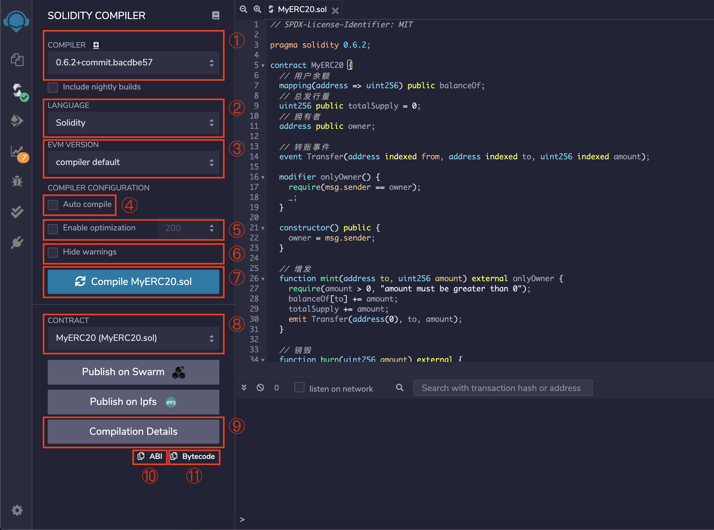
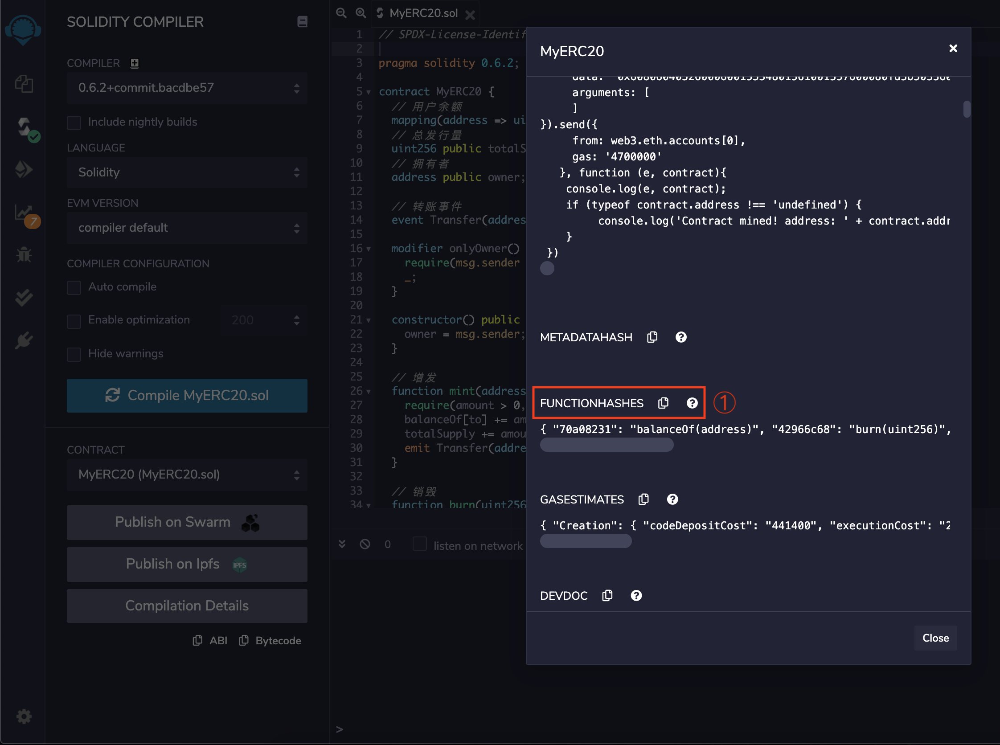
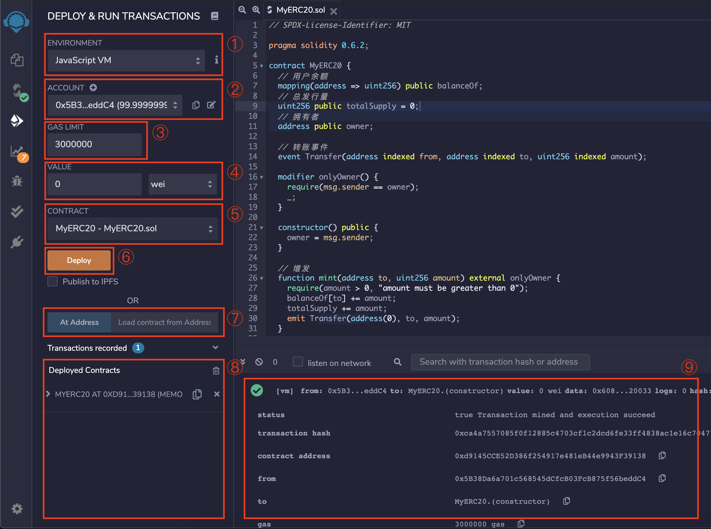

# 第二课

## Remix

[Remix IDE](http://remix.ethereum.org/)

### 编译智能合约

#### 编译面版介绍



1. 选择编译器版本, 大多是时候 IDE 会根据文件头部的声明自动选择

2. 选择要编译的语言, 默认 Solidity 即可

3. 根据以太坊硬分叉选择 EVM 的版本, 每个硬分叉都为 EVM 增加了新的特性, 如果不是想测试旧版本的 EVM 的话, 默认 default 即可

4. 是否自动编译, 勾选的话, 每次修改完都会自动编译一次

5. 是否启用编译优化以及编译优化等级, 一般选用 200 即可, 优化后的合约部署成本更低

6. 是否忽略警告

7. 编译合约

8. 选择要编译的合约`合约名(文件名.sol)`

9. 查看编译细节, 见[编译细节面板介绍](#编译细节面板介绍)

10. 复制合约 ABI(Application Binary Interface), ABI 是一个很大的 json, 一般用于外部和合约交互

11. 复制合约字节码, 字节码就是合约编译的结果

#### 编译细节面板介绍



编译细节面板包含诸多细节, 一般只需要关心`FUNCTIONHASHES`, 这就是上一课所说的`function selector`.如果手动与合约交互, 可能会用到这个

### 部署、调试智能合约

#### 部署、调试面版介绍



1. 选择运行的网络环境

   - JavaScript VM

     使用在浏览器内存中运行的一个虚拟的区块链(每发起一笔交易, 都会为其生成一个新的区块, 但智能合约方面的行为与 EVM 完全一致)作为运行环境. 如果选择此选项, `ACCOUNT`中会自动生成若干个余额为 100 ETH 的账户用于测试

   - Injected Web3

     使用浏览器中的 Web3 插件(一般是 MetaMask)当前的环境作为运行环境. 比如, 如果要链接到 GXChain2.0 的 Testnet, 需要先在 MetaMask 中添加并切换到自定义网络地址, 然后在 Remix 中选择 `Injected Web3`

   - Web3 Provider

     使用手动输入的以太坊节点 RPC 地址作为运行环境, 如 `http://127.0.0.1:8545`

2. 选择调用合约的账户, 点击加号可以增加一个账户(只在`JavaScript VM`时可用)

3. 设置交易的 `GasLimit`, 有时候合约部署失败, 可能是因为这个数值低了, 需要注意

4. 设置交易附带的转账金额及单位, 只有 `payable` 的方法可以接收转账, 如果不是 `payable`, value 必须为 0

5. 选择需要部署的合约`合约名 - 文件名.sol`, 当文件中有多个合约的时候, 请确认合约名字是否是要部署的合约

6. 部署合约到当前的运行环境

7. 如果合约已经部署, 可以填入合约的地址, 并点击`At Address`即可

8. 已部署的合约列表, 可以在此处与合约交互, 见[合约交互面板介绍](#合约交互面板介绍)

   - `🗑️`可以立即清除所有合约

   - `x`清除指定的合约

   - `📋`复制合约地址

9. 当一笔交易发出后, 可以在命令行查看交易的具体参数

#### 合约交互面板介绍


1.  黄色按钮代表此方法会修改以太坊状态树, 需要发起一笔交易才能调用

2.  蓝色按钮代表此方法不会修改以太坊状态树, 只需要进行一次`CALL`就可以调用

    - `📋`复制底层调用参数(`function selector` + 调用参数)

3.  `CALL`的返回结果`返回参数下标: 类型: 值`, 只有`CALL`并且方法有返回参数时, 才可以在这里获取返回参数. 发起交易不能获得合约的返回值. 比如有一个函数`function func() external pure returns(uint256, string memory);`, 调用结果可以是

    ```
    0: uint256: 1
    1: string: xxx
    ```

## Hardhat

[Hardhat Document](https://hardhat.org/getting-started/)

示例项目: [hardhat-erc20-example](https://github.com/samlior/hardhat-erc20-example)

### Hardhat 项目构建

1. 初始化(可通过 Fork 示例项目跳过以下步骤)

   1. `npm i -g hardhat`安装 hardhat

   2. 使用创建目录, 并在新目录下运行`npx hardhat`, 初始化项目

   3. `npm i prettier -D`安装 prettier, 并通过`.prettierrc.js`配置

   4. 通过`hardhat.config.js`配置 hardhat

2. 编写合约(在 contracts 目录下)

3. 编写部署脚本(在 deploy 目录下)

   [示例脚本](https://github.com/samlior/hardhat-erc20-example/blob/master/deploy/MyERC20.js)

4. 编写需要的任务脚本(在 tasks 目录下)

   [示例脚本](https://github.com/samlior/hardhat-erc20-example/blob/master/tasks/index.js)

5. 编写单元测试脚本(在 test 目录下)

   [示例脚本](https://github.com/samlior/hardhat-erc20-example/blob/master/test/MyERC20.js)

### Hardhat 的使用

#### 设置环境变量

```sh
# infura 的 api key
export INFURA_API_KEY=xxx
# 部署合约的账户的助记词
export MNEMONIC="test test test test test test test test test test test junk"
# 部署合约的账户的地址, 需要和助记词匹配
export DEV_ADDR=0x...abc
# etherscan 的 api key, 用于验证合约
export ETHERSCAN_KEY=xxx
```

#### 安装依赖

```sh
npm i
```

#### 编译

```sh
npm run build
```

以上命令实际上运行的是`npx hardhat compile`. 运行后, hardhat 会自动加载`hardhat.config.js`中的配置, 对`contracts`目录下的所有文件进行编译, 编译后的结果(包括 ABI, 字节码等)都将存储在`artifacts`文件夹下. hardhat 提供了各种方法加载合约 ABI 或字节码, 因此一般不需要关心`artifacts`文件夹下的具体内容

#### 部署

```sh
# 部署到goerli测试网络
npm run deploy:goerli
# 部署到bsc
npm run deploy:bsc
# 部署到本地测试节点
npm run node
```

`npm run deploy:goerli`实际上运行的是`npx hardhat --network goerli deploy`, 其中

- `--network` 声明了网络的名称(网络信息配置在`hardhat.config.js`中)
- `deploy` 是 hardhat 内置的一个任务, 调用以后会运行 deploy 目录下的所有脚本

`npm run node`实际上运行的是`npx hardhat node`, 这个命令会让 hardhat 在本地运行一个虚拟的区块链, 默认端口是 8545, 并且在区块链开始运行的同时, 会运行一次 deploy 任务(也就是说会把所有合约部署好)

合约部署完成后, 会将合约的名字、部署后的地址等信息放在`deployments`目录下, 只要不删除此目录下的内容, 之后就可以直接通过合约的名字获取合约地址, ABI 等信息, 比如

```js
task("balance:erc20", "Prints an account's ERC20 balance")
  .addParam("account", "User account")
  .setAction(async (taskArgs, { deployments, web3 }) => {
    // ...
    const { getArtifact, get } = deployments;
    // 通过合约名字获取合约地址
    const addr = await get("MyERC20");
    const contract = new web3.eth.Contract(
      // 通过合约名字获取合约 ABI, 用于初始化 web3 contract 对象
      (await getArtifact("MyERC20")).abi,
      addr,
      from
    );
    // ...
  });
```

#### 运行任务脚本

任务脚本可以完成一系列预设的逻辑, 通过以下方式运行

```sh
npx hardhat --network networkName taskName --taskOption xxx
```

#### 运行单元测试脚本

```sh
npm run test
```

#### 认证合约

**认证合约时, 请先确保可以正常访问[api.etherscan.io](https://api.etherscan.io)**

```sh
npx hardhat verify --network mainnet 0x...abc "LV Coin" "LV" "18"
```

参数依次是`合约地址` `构造参数1` `构造参数2`, 不用关心构造参数的类型, hardhat 会自动处理
