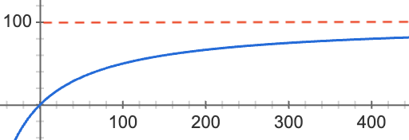

# 第三课

## UniswapV2 智能合约分析

### 什么是 Uniswap?

Uniswap 是一个由智能合约构成的去中心化交易所, 主要合约有三份[Pair](https://github.com/Uniswap/uniswap-v2-core/blob/master/contracts/UniswapV2Pair.sol), [Factory](https://github.com/Uniswap/uniswap-v2-core/blob/master/contracts/UniswapV2Factory.sol), [Router](https://github.com/Uniswap/uniswap-v2-periphery/blob/master/contracts/UniswapV2Router02.sol)

他只做两件事情

1. 让用户为指定的交易对质押流动性, Uniswap 会将指定的交易对的交易手续费均分给所有提供流动性的用户作为回报
2. 只要某两种资产已经被提供了流动性(并且路径相通), 任何人就可以通过 Uniswap 将任意数量的一种资产换成另一种资产

### 交易

Uniswap 的每一个交易对内部都会有一个流动性池子, 里面有若干数量的两种资产. Uniswap 会确保交换之前和交换之后两种资产数量相乘的积不变


其中

- `x` 为当前流动性池子中第一种资产的数量
- `y` 为当前流动性池子中第二种资产的数量
- `k` 为两种乘积

如果有用户通过 Unsiwap 用第一种资产交易出第二种资产, 可推出如下公式


其中

- ![deltax] 为用户输入的第一种资产的数量
- ![deltay] 为 Uniswap 输出的第二种资产的数量

经过变换可得


假设此时此刻 Uniswap 中有第一种资产 100 个, 第二种资产 100 个, 也就是


画出的曲线如下



虽然交换之前流动性池子中两种资产的比例为 1:1, 但根据曲线可以推导出, 输入数量为![deltax]的第一种资产是难以换出数量为![deltax]的第二种资产的(除非输入的数量非常非常小), 损失的部分![deltax] - ![deltay]就被称为**滑点损失**. 因此用户一次性交易的资产数量越多, 滑点损失越大

### 质押赎回流动性

用户向 Uniswap 中质押资产时, 两种资产的比例必须与当前流动性池子中的资产比例一致. 质押资产后, Uniswap 会增发对应交易对的流动性代币给用户, 作为流动性凭证, 随后用户可以随时销毁流动性代币来赎回质押的资产.

增发流动性代币的具体计算公式如下


其中

- `liquidity` 为用户获得的流动性代币数量
- `amountX` 为用户质押的第一种资产的数量
- `amountY` 为用户质押的第二种资产的数量
- `x` 为质押之前, 流动性池子中第一种资产的数量
- `y` 为质押之前, 流动性池子中第二种资产的数量
- `totalSupply` 为质押之前, 流动性代币的总发行量
- `minimumLiquidity` 为流动性池子的最小流动量, 固定为 1000

销毁流动性代币赎回资产的具体计算公式如下


<br/>


其中

- `liquidity` 为用户销毁的流动性代币数量
- `amountX` 为用户可以赎回的第一种资产的数量
- `amountY` 为用户可以赎回的第二种资产的数量
- `x` 为赎回之前, 流动性池子中第一种资产的数量
- `y` 为赎回之前, 流动性池子中第二种资产的数量
- `totalSupply` 为赎回之前, 流动性代币的总发行量

上一节中, 我们介绍了, Uniswap 会确保交换之前和交换之后两种资产数量相乘的积不变


如果假设用户质押的两种资产数量分别为 ![deltax] 和 ![deltay] , 于是质押之后有


`k`增加了


`k`越大, 同样交易金额的情况下, 用户遭受的滑点损失越小. 因此质押的用户越多, 对交易的用户越有利

### 交易手续费

Uniswap 目前对每一笔交易收取千分之 3 都手续费(之前的公式为了方便大家理解, 其实没有计算手续费)

如果设


那么有


经过变换可得


不计算手续费时, 用户输入![deltax]的第一种资产, 可以换出![deltay]的第二种资产, 计算手续费时, 用户输入![deltax]的第一种资产, 可以换出![deltay']的第二种资产, 因此有 ![deltay] - ![deltay'] 数量的第二种资产作为手续费被留在了流动性池子中, 那么此时收取的手续费可以表示为


如果此时是用第二种资产去交换第一种资产, 则道理相同, 收取的手续费可以表示为


综上, Uniswap 会对输出的资产收取一定数量的手续费, 这部分手续费就留在了 Uniswap 的流动性池子中. 假设在一个已经建立好流动性的交易对中, 存在两个时间点, 两个时间点之间没有任何用户进行质押或者赎回操作, 但存在`n`笔从第一种资产到第二种资产的交易和`n'`笔第二种资产到第一种资产的交易, 并且从开始时间点到结束时间点, 两种资产的变动金额分别为 ![deltax] 和 ![deltay]

此时间段内, 收取的手续费可以表示为


<br/>


如果一个用户持有数量为`liquidity`的流动性代币, 那么在开始的时间点, 他可以赎回的两种代币数量分别为


<br/>


在结束的时间点, 他可以赎回的两种代币的数量分别为


<br/>


这段时间内, 该用户的收益就可以表示为


<br/>


注意此时 `profitX` 和 `profitY` 可能是负的, 比如当第一种资产的价格暴跌的时候, 大家都用第一种资产换第二种资产(也就是都发起 XToY 的交易), 这时 `profitX` 是正的, `profitY` 是负的

### 无偿损失

设两种代币对美元的价格分别为 `priceX` 和 `priceY`, 那么一段时间内的收益(折合成美元)就是


如果此时 `profitUSD` 为负, 可以称为用户遭受了**无偿损失**(所以向 Unsiwap 中提供流动性可能不仅不赚钱, 还亏钱). 只有当交易产生的手续费大于无偿损失时, 参与质押的用户才能获取收益

[deltax]: <https://render.githubusercontent.com/render/math?math=%5cDelta x>
[deltay]: <https://render.githubusercontent.com/render/math?math=%5cDelta y>
[deltax']: <https://render.githubusercontent.com/render/math?math=%5cDelta x%27>
[deltay']: <https://render.githubusercontent.com/render/math?math=%5cDelta y%27>

## 课堂作业

1.  写一个 Deployer 合约部署 WETH, UniswapV2Factory, UniswapV2Router, ~~MasterChef 以及一个你自己发行的 ERC20 代币~~

    要求:

    - 可以设置一个 devAddress, 代表开发者账户
    - ~~devAddress 需要有 ERC20 代币的增发及暂停权限~~
    - ~~MasterChef 的拥有者需要转移给 devAddress~~
    - UniswapFactory 的 feeTo 需要被设置为 devAddress
    - 外部有办法获取创建的各个合约的地址

    提示:

    - Uniswap 创建 pair 时用了`create2`, 那是为了确保 pair 的地址和计算的结果一致, 如果不关心创建的合约的地址, 可通过下面这种方式, 在一个合约中创建另一个合约

      ```solidity
      // SPDX-License-Identifier: MIT

      pragma solidity 0.6.2;

      contract Sample {
          function hi() external pure returns(string memory) {
              return "hellow";
          }
      }

      contract Deployer {
          address public sample;

          constructor() public {
              sample = address(new Sample());
          }
      }
      ```

    - 可以在 Etherscan 上获取到 [WETH](https://etherscan.io/address/0xc02aaa39b223fe8d0a0e5c4f27ead9083c756cc2#code), [UniswapV2Router02](https://etherscan.io/address/0x7a250d5630B4cF539739dF2C5dAcb4c659F2488D#code) 以及 [UniswapV2Factory](https://etherscan.io/address/0x5C69bEe701ef814a2B6a3EDD4B1652CB9cc5aA6f#code) 的代码. 但需要注意的是, Uniswap 代码必须被修改过才可以正常使用

      ```solidity
      // UniswapV2Factory.sol
      // ...

      contract UniswapV2Factory is IUniswapV2Factory {
          // ...

          function getCodeHash() external pure returns (bytes32) {
              bytes memory bytecode = type(UniswapV2Pair).creationCode;
              return keccak256(bytecode);
          }
      }

      // ...
      ```

      ```solidity
      // UniswapV2Router02.sol
      // ...

      interface IUniswapV2Factory {
        // ...

        function getCodeHash() external pure returns (bytes32);
      }

      // ...

      library UniswapV2Library {
          // ...

          // calculates the CREATE2 address for a pair without making any external calls
          function pairFor(
               address factory,
               address tokenA,
               address tokenB
          ) internal pure returns (address pair) {
              (address token0, address token1) = sortTokens(tokenA, tokenB);
              pair = address(
                  uint256(
                      keccak256(
                          abi.encodePacked(
                              hex"ff",
                              factory,
                              keccak256(abi.encodePacked(token0, token1)),
                              IUniswapV2Factory(factory).getCodeHash() // init code hash
                          )
                      )
                  )
              );
          }
      }

      // ...
      ```

1.  ~~写一个工具合约, 帮助用户在 Uniswap 中质押流动性后, 立马将流动性代币放入 MasterChef 中挖矿~~

请将合约代码, 测试网络名称, 合约地址发到<samlior@foxmail.com>, 同时附上名字

<details>
<summary>参考答案</summary>


</details>
